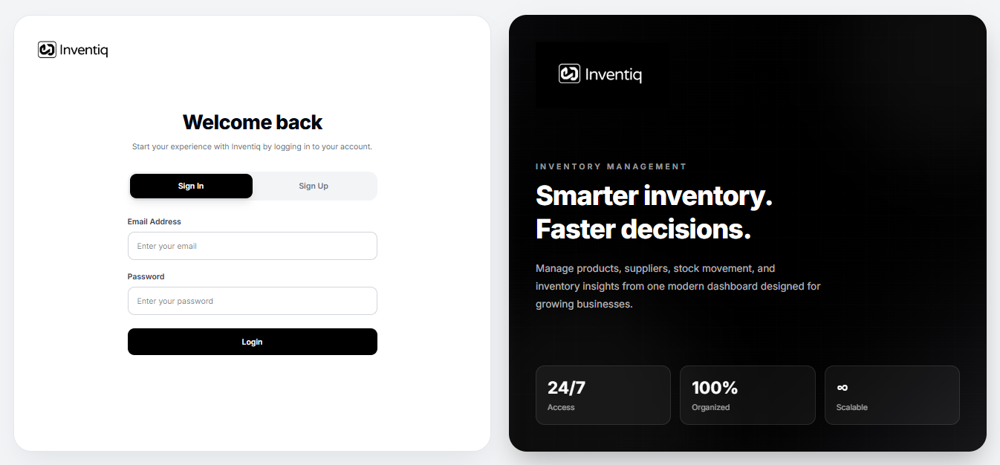

# Inventiq

<p align="center">
    
</p>

<p align="center">
A modern Inventory Management System built with <strong>Laravel</strong>, <strong>Vue 3</strong>, <strong>Inertia.js</strong>, <strong>Tailwind CSS</strong>, and <strong>MySQL</strong>.
</p>

---

# Features

## Authentication

- User Login
- User Registration
- Form Validation
- Session Authentication

---

## Dashboard

- Inventory Statistics
- Quick Overview Cards
- Modern Responsive Layout

---

## Product Management

- Create Products
- Update Products
- Delete Products
- Product Search
- Product Filtering
- Product Sorting
- Product Pagination
- Product Status

---

## Category Management

- Create Categories
- Edit Categories
- Delete Categories
- Search Categories
- Pagination

---

## Supplier Management

- Create Suppliers
- Update Suppliers
- Delete Suppliers
- Search Suppliers
- Pagination

---

## Stock Movement

- Stock In
- Stock Out
- Stock Movement History
- Previous Stock Tracking
- New Stock Tracking
- Reference Numbers
- Notes
- Date Filtering
- Pagination

---

## User Experience

- Responsive Design
- Modern Authentication Interface
- Card-based Dashboard
- Interactive Tables
- Search & Filtering
- Loading States
- Validation Messages
- Clean UI

---

# Technology Stack

## Backend

- Laravel 12
- PHP 8.2+
- MySQL
- Eloquent ORM

## Frontend

- Vue 3
- Inertia.js
- Tailwind CSS
- Axios
- Vite

---

# Installation & Setup

## Prerequisites

Make sure the following are installed:

- PHP 8.2+
- Composer
- Node.js 20+
- npm
- MySQL 8+
- Git

---

## Clone the Repository

```bash
git clone https://github.com/Etherms/inventiq.git
```

```bash
cd inventiq
```

---

## Install Dependencies

### PHP

```bash
composer install
```

### JavaScript

```bash
npm install
```

---

## Environment Setup

Copy the environment file:

```bash
cp .env.example .env
```

Generate the application key:

```bash
php artisan key:generate
```

Configure your database inside `.env`

```env
DB_CONNECTION=mysql
DB_HOST=127.0.0.1
DB_PORT=3306
DB_DATABASE=inventiq
DB_USERNAME=root
DB_PASSWORD=
```

---

## Database Setup

Run migrations:

```bash
php artisan migrate
```

Seed the database:

```bash
php artisan db:seed
```

Or create everything from scratch:

```bash
php artisan migrate:fresh --seed
```

---

# Running the Project

## Start Laravel

```bash
php artisan serve
```

Laravel will be available at:

```
http://127.0.0.1:8000
```

---

## Start Vite

Open another terminal.

```bash
npm run dev
```

Vite Development Server:

```
http://localhost:5173
```

---

## Production Build

```bash
npm run build
```

---

# Useful Artisan Commands

Clear all caches

```bash
php artisan optimize:clear
```

Clear configuration cache

```bash
php artisan config:clear
```

Clear route cache

```bash
php artisan route:clear
```

Clear view cache

```bash
php artisan view:clear
```

Cache configuration

```bash
php artisan config:cache
```

Display all registered routes

```bash
php artisan route:list
```

---

# Project Structure

```
app/
bootstrap/
config/
database/
public/
resources/
├── assets/
│   └── images/
├── css/
├── js/
│   ├── Components/
│   ├── Layouts/
│   └── Pages/
routes/
storage/
tests/
```

---

# Screenshots

The application preview image can be found here:

```
resources/assets/images/inventiq_Image.png
```

---

# Future Improvements

- Barcode Scanner
- QR Code Support
- Purchase Orders
- Sales Management
- Reports & Analytics
- Export to Excel
- Export to PDF
- User Roles & Permissions
- Audit Logs
- Notifications
- Dark Mode
- Multi-Warehouse Support

---

# License

This project is intended for educational and portfolio purposes.

---

# Author

## Edson Hermosa

**Software Developer**

- Laravel Developer
- Vue.js Developer
- Frontend Developer
- Full Stack Web Developer